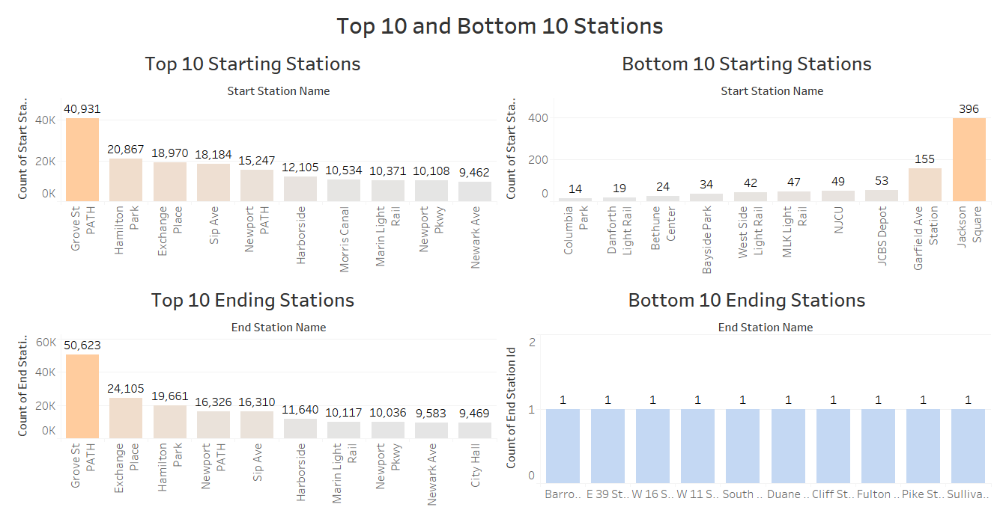

# Citi Bike Analytics

This project consisted of generating regular reports for New York city officials looking to publicize and improve the largest bike sharing program in the United States - CITI Bike.

Since 2013, the Citi Bike Program has implemented a robust infrastructure for collecting data on the program's utilization. Through the team's efforts, each month bike data is collected, organized, and made public on the [Citi Bike Data](https://www.citibikenyc.com/system-data) webpage. However, while the data has been regularly updated, the team has yet to implement a dashboard or sophisticated reporting process. City officials have a number of questions on the program, and this repo contains sets of data reports build to provide answers to some of their questions and more.

## Data Source and Cleaning

Data obatined from the Citi Bike Trip History Logs ran from January 2018 through December 2018 and were available as csv files for each month.
To begin, the csv files were merged using a Python and then exported as a csv file. The concatenated file was then used in Tableau to build a series of worksheeets and dashboards (displayed as images for the purpose of this project) for better interpretation.

The data included:
* Trip Duration (seconds)
* Start Time and Date
* Stop Time and Date
* Start Station Name
* End Station Name
* Station ID
* Station Lat/Long
* Bike ID
* User Type (Customer = 24-hour pass or 3-day pass user; Subscriber = Annual Member)
* Gender (Zero=unknown; 1=male; 2=female)
* Year of Birth

**The data used was processed by Citi Bike to remove trips that were taken by staff as they serviced and inspected the system, trips that were taken to/from any of their “test” stations, and any trips that were below 60 seconds in length (potentially false starts or users trying to re-dock a bike to ensure it's secure).**

## Reports and Observations

### Dashboards

#### Observation I - Summer and Winter Season Peak Hours

* The images above show that, the Peak hours for the Winter season were between 7am-9am and 5pm-7pm which sounds accurate given those are rush hours.
* A similar trend was observed for the Summer season with higher activity during rush hours but the were more bikes riden in-between those intervals possibly due to favorable weather conditions.

#### Observation II - Top 10 and Bottom 10 Stations

* The bar graphs above represent the top 10 and bottom 10 starting and ending stations based on the Station Id's. One thing that can be observed is that, 9 out of the top starting stations are listed as one of the top ending stations as well and vice versa, "Grove St PATH" being the highest starting and ending station. Probably because it's located at the heart of Jersey City (as you'll notice from Observation VI).

#### Observation III - Gender Distribution

* The pie chart above represents a demographic of the ration of male to female to unknown active participants in the Citi Bike program. As you could observe, one of the challenges faced when interpreting the data was working with an unknown % of individuals.
* It was hard to tell whether these individuals chose not to identify or belonged to another classification of gender, even though it wouldn't have made much of a difference since the male population had a significantly higher ratio of 72.66%.

#### Observation IV - Tripduration by Age

* The 4th observation shows how the average trip duration varies by age, with the age range between 16 and 18 having the highest average trip duration, followed by individuals aged 79, 71 and 49, which I found rather interesting.

#### Observation V - Top 20 Bikes with Longest Trip Duration

* The bubble chart above represents the top 20 bikes (displayed by their IDs) which the highest trip durations that were most likely due for repair/inspection over time thanks to worn out tires.

### Maps

#### Observation VI - Popular Start and Ending Stations

* The maps above displays a distribution of the starting and ending locations.
* Most starting stations were in the New Jersey area, while the ending stations were distributed throughout New Jersey and New York although the top starting and ending stations were stil located in NJ.
* This could imply that a lot of those transiting on bikes, work in New York but reside in the Jersey area - My guess is the more affordable cost of living in New Jersey is a determining factor.

#### Observation VII - Top 30 Starting and Ending Stations per Housing Unit Growth

* The second map focuses on the coast of New Jersey and shows the relationship between the Percentage Housing Unit Growth between 2018 & 2023 and the Top 30 Popular Stations.
* The most popular stations were mostly located in areas with higher Housing Unit Growrth - Grove St PATH being the busiest and located at the Heart of Jersey City.